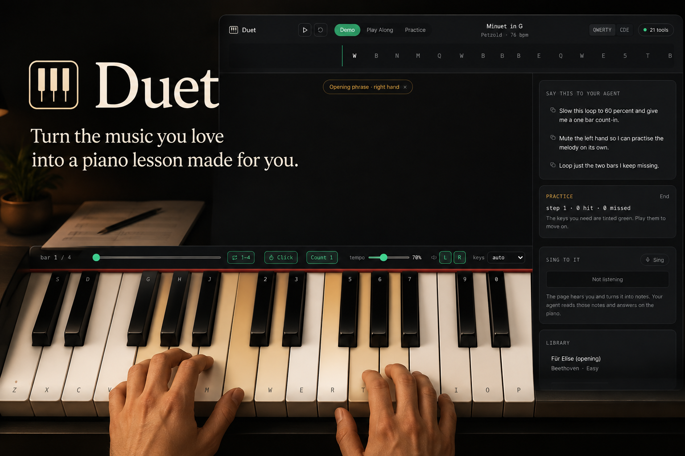
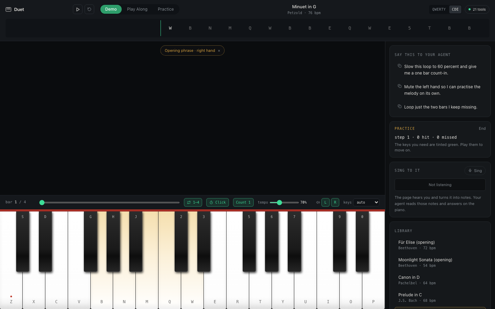
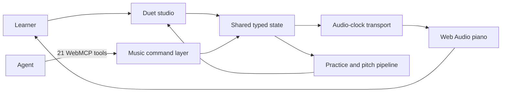

# Duet

**Duet turns “help me practise these four bars” into a lesson you can play a moment later.**



Ask your agent to load a piece, keep one hand, slow it down, loop the difficult bars, count you in, highlight the phrase and begin practice. Through WebMCP, Duet makes every change inside the same browser piano you are playing.

There is no Duet account and no API key to paste into the app. The learner brings their WebMCP-capable agent; Duet provides the instrument and 21 musical tools.

## Try the judge moment

Open Duet, press any piano key once to unlock browser audio, connect an agent and say:

> Load Minuet in G. Keep only the right hand, slow it to 70 percent, loop bars 1–4, add a one-bar count-in and metronome, highlight G4 A4 B4 C5 D5 as “Opening phrase · right hand,” and start practice. Read the transport and the first score page, then tell me exactly what changed.

The request becomes a visible, playable lesson:

- Minuet in G loads and the tempo changes.
- Only the right hand remains.
- Bars 1–4 become the active loop.
- The count-in and metronome switch on.
- The opening notes light up on the piano.
- Practice mode begins and tracks the next expected note.
- The activity rail records the agent’s work separately from human actions.



## Why WebMCP belongs here

An agent can explain how to practise a piece, but advice in a chat still leaves the learner rebuilding the lesson by hand. Clicking the page is not enough either: music depends on score structure, browser audio state, timing, transport position and device permissions.

Duet exposes musical intent instead of screen coordinates. Its tools work with pieces, notes, bars, hands, tempo, loops, count-ins, metronome, mix, practice and captured phrases. The learner and agent share one score, one transport and one visible history.

## A better experience for the learner

One request replaces the usual trail of disconnected steps: finding the score, changing the tempo, muting one hand, setting a metronome, rebuilding a loop and remembering which notes need attention. Every agent action appears in the instrument immediately, so the learner can understand it, play it and change it again.

Duet does not hide the collaboration behind a chat response. The title, score, tempo, loop, mix, highlighted keys, practice progress and activity history all become visible evidence of what the agent did.

## What the learner and agent do together

The learner brings the goal and the performance. The agent reads the current musical state, turns the request into a sequence of safe actions and verifies the result. The learner then plays the lesson, asks for another adjustment or sings a short phrase that Duet converts into notes for the agent to read.

That shared loop was difficult before WebMCP: explain, configure, play, observe and refine all happened in separate places. In Duet they happen around one instrument without taking control away from the person.

## What works today

- Responsive piano with a focused learning range or all 88 keys
- Mouse, touch and A–Z/0–9 computer-keyboard input
- Fourteen public-domain pieces and exercises
- Agent-supplied structured arrangements of up to 600 notes
- Demo, Play Along and Practice modes
- Tempo, transposition, simplification, bar slicing and hand isolation
- Play, pause, true resume, stop, seek, loop, count-in, metronome and hand mix
- Web Audio scheduling, reverb, output metering and reliable all-voice stop
- Note or QWERTY labels, key highlights and expected-note practice
- Monophonic microphone phrase capture with agent-readable notes
- Bounded score pagination and stable, actionable tool errors
- Human, agent and system activity attribution

## Built for more than one agent

We tested the WebMCP workflow with **OpenAI Codex** and **Anthropic Claude**. Both clients used the same tool surface to discover capabilities, inspect the score, transform a piece, configure the transport, highlight notes and begin practice.

The automated browser journey uses an in-page `document.modelContext` harness. It registers all 21 tools and reproduces the full Minuet lesson at desktop and laptop widths.

Current verification:

- 72/72 Vitest tests passing
- 4/4 Playwright journeys passing
- TypeScript check passing
- ESLint passing
- Production build passing
- Score pages verified below the 1,500-character response budget

## How WebMCP is implemented



- React 19 and TypeScript render the studio.
- Zustand gives human controls and WebMCP tools one command and state layer.
- Web Audio provides the piano engine, effects and scheduling clock.
- Zod validates every tool input and structured arrangement.
- Vitest covers music, pitch, store and tool contracts.
- Playwright verifies the shared human-and-agent journey in Chromium.

Each tool is registered through `document.modelContext.registerTool` with a name, agent-facing description, JSON input schema, read/write annotations and an `execute` function. The shared registration hook normalizes successful and failed responses and uses an `AbortController` to unregister tools cleanly when the page lifecycle changes.

```ts
document.modelContext.registerTool(
  {
    name,
    description,
    inputSchema,
    annotations,
    async execute(args: unknown) {
      const result = await latest.current.execute(args);
      return toToolResponse(result);
    },
  },
  { signal: controller.signal },
);
```

The complete implementation is in [`src/webmcp/DuetTools.tsx`](src/webmcp/DuetTools.tsx) and [`src/webmcp/useWebMCPTool.ts`](src/webmcp/useWebMCPTool.ts).

## All 21 WebMCP tools

| Tool                    | Type   | What it lets an agent do                                                |
| ----------------------- | ------ | ----------------------------------------------------------------------- |
| `duet.get_capabilities` | Read   | Discover the available instrument, transport and device features        |
| `duet.get_state`        | Read   | Read the current piece, mode, practice and activity state               |
| `duet.read_transport`   | Read   | Inspect position, tempo, loop, count-in, click and hand mix             |
| `duet.read_score`       | Read   | Read a bounded page of notes by bar range or cursor                     |
| `duet.play_notes`       | Action | Play a supplied phrase or chord sequence                                |
| `duet.load_piece`       | Action | Load a library piece or structured arrangement                          |
| `duet.play_piece`       | Action | Start the active piece from the beginning or a selected bar             |
| `duet.pause`            | Action | Pause while preserving the exact musical position                       |
| `duet.resume`           | Action | Continue from the paused position                                       |
| `duet.stop`             | Action | Stop the transport and silence scheduled voices                         |
| `duet.seek`             | Action | Move to a particular bar or beat                                        |
| `duet.set_loop`         | Action | Create, change or clear a loop                                          |
| `duet.set_metronome`    | Action | Configure the metronome                                                 |
| `duet.set_count_in`     | Action | Add a zero-, one- or two-bar count-in                                   |
| `duet.set_mix`          | Action | Isolate or rebalance the left and right hands                           |
| `duet.transform_piece`  | Action | Change tempo, key, bars, hands or difficulty                            |
| `duet.highlight_keys`   | Action | Highlight named keys with a visible lesson label                        |
| `duet.listen`           | Action | Ask the browser to begin capturing a sung or hummed phrase              |
| `duet.stop_listening`   | Action | Finish capture and turn the phrase into structured notes                |
| `duet.read_phrase`      | Read   | Read the most recently captured phrase without reopening the microphone |
| `duet.start_practice`   | Action | Begin expected-note practice on the active piece                        |

## Run locally

Duet requires Node.js 20 or newer and a modern Chromium browser.

```bash
npm install
npm run dev
```

Open the printed URL and press a piano key or **Play** once to unlock sound. In a WebMCP-capable browser, the tools register automatically while the page is open.

## Verify the build

```bash
npm run typecheck
npm run lint
npm test
npm run build
npm run test:e2e
```

## Browser boundaries

- Read-only tools never activate audio or the microphone.
- Sound requires a human gesture before the browser unlocks its audio context.
- Microphone capture requires an explicit browser permission prompt.
- Duet reports stable errors such as `AUDIO_LOCKED` and `MIC_UNAVAILABLE` instead of claiming an action worked.
- Both hands cannot be muted at the same time.
- Large scores are paginated instead of silently truncated.

## Honest limits

Duet currently accepts built-in or agent-supplied structured notes. MIDI, MusicXML, score-image and PDF import are future work. Practice checks expected pitch but does not yet score timing, dynamics or polyphonic microphone input. The pitch pipeline has synthesized-signal test coverage but still needs a broader real-device matrix. The piano uses lightweight Web Audio synthesis rather than a large sampled instrument.

## Submission material

- [Devpost copy](devpost-submission.md)
- [Demo script](docs/submission/DEMO_SCRIPT.md)
- [Judge and capture guide](docs/submission/JUDGE_GUIDE.md)

## License

Duet is available under the [MIT License](LICENSE). Its built-in repertoire is public domain.
